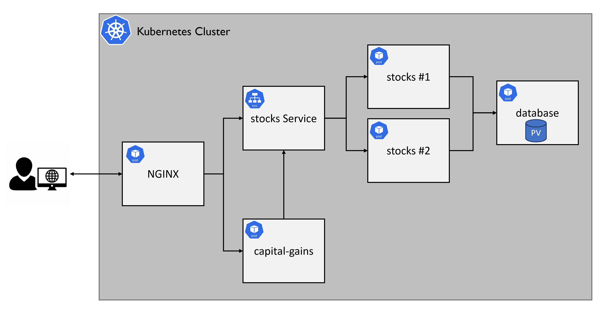

# Multi-Service Kubernetes Application

## Introduction

A Kubernetes-based deployment of a multi-service financial analytics platform. 
The platform focuses on deploying a multi-service application using Kubernetes, building upon previous experience with Docker Compose. 
It demonstrates fundamental Kubernetes concepts, including Deployments, Services, ConfigMaps, reverse proxies using NGINX, and Persistent storage, to manage application availability, scalability, and networking within a cluster.

## Project Structure

The project is organized to deploy a multi-service application, with each micro-service having its dedicated folder containing its code, Dockerfile, and Kubernetes YAML manifests. The overall structure is as follows:

```plaintext
├── multi-service-app/
│   ├── namespace.yaml
│   ├── stocks/
│   │   ├── deployment.yaml
│   │   ├── service.yaml
│   │   ├── app.py
│   │   └── Dockerfile
│   ├── capital-gains/
│   │   ├── deployment.yaml
│   │   ├── service.yaml
│   │   ├── app.py
│   │   └── Dockerfile
│   ├── database/
│   │   ├── deployment.yaml
│   │   ├── service.yaml
│   │   ├── persistentVolume.yaml
│   │   ├── persistentVolumeClaim.yaml
│   ├── nginx/
│   │   ├── deployment.yaml
│   │   ├── service.yaml
│   │   ├── configmap.yaml
└── kind-config.yaml
└── README.md
```

## Architecture

The deployed system implements a multi-service architecture as depicted in the diagram below. 
All micro-services (NGINX, stocks, capital-gains, database) are exposed to network traffic by Kubernetes `Service` resources.



### Services Implemented:

  * **Stocks Service**: Two instances of a stock service providing a REST API for stock management, with load balancing handled by a Kubernetes Service to distribute traffic evenly. Data persistence is ensured through integration with the database.
  * **Capital Gains Service**: A single instance of a capital gains service, communicating with the stocks service to perform calculations.
  * **NGINX Service**: Configured as a reverse proxy. Acts as an entry point for HTTP traffic, routing external requests to the appropriate internal services (stocks, capital-gains) based on the request path, using a custom ConfigMap.
  * **Database Service**: A MongoDB instance Utilized for data persistence for the microservices, ensuring data retention across Pod restarts and crashes. Leverages Kubernetes `PersistentVolume` and `PersistentVolumeClaim` for reliable storage.

## Prerequisites

Before deploying the application, ensure you have the following tools installed:

  * [Git](https://git-scm.com/book/en/v2/Getting-Started-Installing-Git)
  * [Docker](https://docs.docker.com/engine/install/)
  * [kind](https://kind.sigs.k8s.io/docs/user/quick-start/)
  * [kubectl](https://kubernetes.io/docs/tasks/tools/)

## Getting Started

Follow these steps to deploy and test the multi-service application on a local Kubernetes cluster using Kind.

### 1\. Clone the Repository

```bash
git clone https://github.com/shpitzery/k8s-stocks-application.git
```

### 2\. Create a KIND Cluster

Ensure your Docker engine is running, then create the Kubernetes cluster:

```bash
kind create cluster --config kind-config.yaml
```

Verify the `kubectl` context is set to your new cluster:

```bash
kubectl cluster-info
```

### 3\. Create a Namespace in the Cluster

Without a namespace, all resources go into the default namespace.<br>
To create the namespace in the cluster, run the following command:
```bash
kubectl apply -f ./multi-service-app/namespace.yaml
```

### 4\. Build and Load Docker Images

Navigate into the `multi-service-app` directory. For the `stocks` and `capital-gains` services, you will need to build their Docker images and load them into the Kind cluster. For NGINX and MongoDB, public images can be used.

**Important**: Ensure `imagePullPolicy: IfNotPresent` is set in your Deployment YAMLs to use the locally loaded images.

From the root directory run:

```bash
docker build -t stocks:latest -f ./multi-service-app/stocks/Dockerfile ./multi-service-app/stocks
kind load docker-image stocks:latest

docker build -t capital-gains:latest -f ./multi-service-app/capital-gains/Dockerfile ./multi-service-app/capital-gains
kind load docker-image capital-gains:latest
```

**Note**: In the command `docker build -t <service_name>:latest -f ./multi-service-app/<service_name>/Dockerfile ./multi-service-app/<service_name>`:

* `<service_name>:latest`: The **tag** for the Docker image that will be built. It assigns a name (`<service_name>`) and a version (`latest`) to the image, for easy reference later.
* `-f ./<service_name>/Dockerfile`: This specifies the **path to the Dockerfile** that Docker should use for building the image.
* `./<service_name>`: This is the **build context**. It tells Docker where to look for the files and directories that should be included in the build process.


### 5\. Deploy Kubernetes Resources

You should use the `kubectl apply` command to deploy your resources into your cluster. Ensure you are targeting your desired cluster.
To streamline the deployment, use the provided `deploy_app.sh` script by running the below commands, which applies all Kubernetes resources in the correct order.
```bash
# From the root directory
chmod +x deploy_app.sh
./deploy_app.sh
```
**Note**: Make sure all resources are deployed within the same non-default namespace.

### 6\. Verify Deployment Status

Validate your resource (Pod, Deployment, Service, etc.) was created as expected by running the following command:

```bash
# Example: kubectl get pods -n <namespace-name> -o yaml
kubectl get <resource-name> -n <resource-namespace> -o yaml 
```

**Important**: Make sure to validate your Pods were created successfully.<br>
Run the following command to get all the Pods in a specific namespace:

```bash
kubectl get pods -n <namespace-name>
```

The output should look as follows:
```bash
NAME                             READY   STATUS    RESTARTS   AGE
stocks-6d967d75cb-72xrw          1/1     Running   0          11h
stocks-6d967d75cb-ug84r          1/1     Running   0          11h
capital-gains-1d947a758b-g7bjj   1/1     Running   0          11h
nginx-5er68d65c9-tnsst           1/1     Running   0          11h
mongo-2q93yd1514-tbasyn          1/1     Running   0          11h
```

**Note**: All Pods should eventually show a `STATUS` of `Running`. If one of the Pods is not in the Running status, you should investigate what might cause it.
You can view the Pod's definition and its status by running the following command:

```bash
kubectl get pods <pod-name> -n <namespace-name> -o yaml
```

The status section usually contains useful information about the Pod's health and the error description (if it exists).
If the Pod's container prints any logs, you can view them by running the following command:
```bash
kubectl logs <pod-name> -n <namespace-name> -c <container-name>
```

### 7\. Test the Application

The application's REST API should be accessible via `http://127.0.0.1:80/`, which is handled by the NGINX reverse proxy.

  * **Stocks Service**: `http://127.0.0.1:80/stocks`
  * **Capital Gains Service**: `http://127.0.0.1:80/capital-gains`

You can use `curl` or a web browser to test the endpoints.

#### Validate Data Persistency

1.  Add some stock data:
    ```bash
    curl -X POST -H "Content-Type: application/json" -d '{"symbol": "GOOGL", "purchase price": 20.0, "shares": 10}' http://127.0.0.1:80/stocks
    ```
2.  Retrieve stock data:
    ```bash
    curl http://127.0.0.1:80/stocks
    ```
3.  Get the database Pod name:
    ```bash
    kubectl get pods -n <your-namespace-name>
    ```
4.  Delete the database Pod:
    ```bash
    kubectl delete pod <database-pod-name> -n <your-namespace-name>
    ```
5.  Wait for a new database Pod to be `Running`.
6.  Retrieve stock data again:
    ```bash
    curl http://127.0.0.1:80/stocks
    ```
    The data should still be present, demonstrating persistence.

### 8\. Run Sanity Test Script

Run `test.sh` script to perform a basic sanity test of the deployment. Ensure the `multi-service-app` folder is in the same directory as the script.

```bash
bash test.sh
```

Optional arguments:

```bash
bash test.sh --timeout 300 --skip-create-cluster
```

  * `timeout`: Maximum seconds to wait for Pods to become running (default: 300).
  * `skip-create-cluster`: Skips cluster creation, useful for re-running tests.

Successful execution will show:

```
The sanity test for http://localhost:80/stocks passed successfully.
The sanity test for http://localhost:80/capital-gains passed successfully.
```

## Clean Up

To delete the Kind cluster and all deployed resources:

```bash
kind delete cluster --name kind # Or your cluster name if different
```

Verify cluster deletion:

```bash
kind get clusters
```
